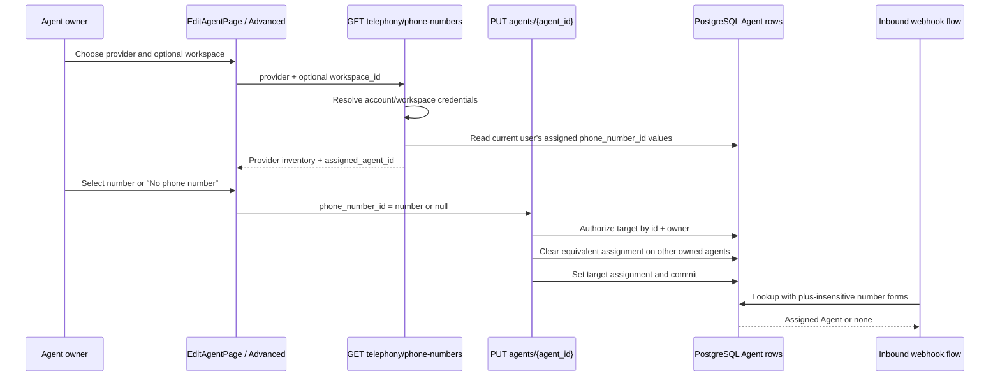

# Agent phone-number assignment

## Definition

Agent phone-number assignment is the control-plane-to-routing contract that lets an owner select a live Twilio or Telnyx number under **Agents → Advanced**, persist that number on one owned agent, and resolve later inbound calls regardless of whether the provider supplies a leading `+` (`frontend/src/app/dashboard/agents/[id]/page.tsx:1629-1697`, `backend/app/api/agents.py:331-346`, `backend/app/api/telephony.py:165-172`).

## End-to-end flow

## Read path: populating the selector

1. The editor watches provider and selected workspaces (`frontend/src/app/dashboard/agents/[id]/page.tsx:423-425`).
2. It requests live provider inventory using the first selected workspace, or omits `workspace_id` for account-level credentials (`frontend/src/app/dashboard/agents/[id]/page.tsx:427-447`).
3. The endpoint validates the optional UUID, resolves the requested provider, and returns empty inventory if credentials are absent (`backend/app/api/telephony.py:319-343`).
4. The endpoint separately loads the current user's non-null agent assignments and creates a plus-insensitive map (`backend/app/api/telephony.py:345-355`).
5. Every provider number receives `assigned_agent_id` when its normalized number matches (`backend/app/api/telephony.py:357-367`).
6. The UI displays friendly names and marks numbers in use by a different agent (`frontend/src/app/dashboard/agents/[id]/page.tsx:1667-1674`).

## Write path: assignment, unassignment, and reassignment

The form sends the actual phone-number string, not the provider record ID (`frontend/src/app/dashboard/agents/[id]/page.tsx:1667-1670`). The `none` sentinel and empty values are serialized as `null`, preserving explicit unassignment (`frontend/src/app/dashboard/agents/[id]/page.tsx:599-600`, `frontend/src/app/dashboard/agents/[id]/page.tsx:1663-1666`).

The backend uses Pydantic's `model_fields_set` to distinguish three states (`backend/app/api/agents.py:331-346`):

| Request state   | Meaning                                      | Result                                                                                   |
| --------------- | -------------------------------------------- | ---------------------------------------------------------------------------------------- |
| Field omitted   | Caller is not changing telephony assignment. | Existing value remains.                                                                  |
| Concrete string | Assign or reassign this number.              | Equivalent assignment on another owned agent is cleared; target stores requested string. |
| Explicit `null` | Disable inbound routing for this agent.      | Target stores `NULL`.                                                                    |

Target authorization combines agent UUID and authenticated owner ID before mutation (`backend/app/api/agents.py:317-329`). Reassignment searches only sibling agents owned by that same user, clears matching normalized or plus-prefixed forms, then commits those changes with the target update (`backend/app/api/agents.py:331-352`).

## Inbound routing path

Inbound lookup removes leading plus signs from the received number, then queries for either stored representation (`backend/app/api/telephony.py:160-172`). This permits assignments stored as `+15551234567` to match inbound `15551234567`, and vice versa. The lookup returns one agent or `None`; duplicate equivalent assignments violate its single-result expectation (`backend/app/api/telephony.py:169-172`).

## Invariants

1. **Owner authorization:** only an agent owned by the authenticated user can be changed (`backend/app/api/agents.py:317-329`).
2. **Single equivalent assignment per owner:** reassignment clears matching siblings before writing the target (`backend/app/api/agents.py:331-346`).
3. **Explicit null is meaningful:** generic update logic must not swallow unassignment (`backend/app/api/agents.py:331-349`, `backend/app/api/agents.py:386-389`).
4. **Provider inventory is live:** selector choices come from provider APIs, while assignments are stored on `Agent.phone_number_id` (`backend/app/api/telephony.py:326-365`).
5. **Normalization is intentionally narrow:** only leading plus signs are ignored (`backend/app/api/telephony.py:160-162`).

## UI states

- **Loading:** selector is disabled while provider numbers load (`frontend/src/app/dashboard/agents/[id]/page.tsx:1653-1657`).
- **No inventory:** a dashed empty state links to phone-number purchasing (`frontend/src/app/dashboard/agents/[id]/page.tsx:1635-1650`).
- **Inventory available:** selector includes unassignment plus every provider number (`frontend/src/app/dashboard/agents/[id]/page.tsx:1652-1677`).
- **Assigned elsewhere:** item remains selectable and is labeled “In use by another agent”; reassignment is deliberate and explained below the control (`frontend/src/app/dashboard/agents/[id]/page.tsx:1671-1681`).
- **Manage inventory:** a direct link opens `/dashboard/phone-numbers` (`frontend/src/app/dashboard/agents/[id]/page.tsx:1682-1690`).

## Failure and recovery semantics

- Invalid workspace UUID returns HTTP 400 before provider access (`backend/app/api/telephony.py:319-324`).
- Unsupported provider returns HTTP 400 (`backend/app/api/telephony.py:342-343`).
- Missing provider credentials returns an empty list, which the UI presents as no available numbers (`backend/app/api/telephony.py:328-340`, `frontend/src/app/dashboard/agents/[id]/page.tsx:1635-1650`).
- Unauthorized target mutation returns 404 and preserves state (`backend/app/api/agents.py:317-329`, `backend/tests/test_api/test_agent_phone_assignment.py:98-121`).
- Provider-list failure follows the shared API/TanStack Query error path; assignment persistence itself does not call the provider (`frontend/src/app/dashboard/agents/[id]/page.tsx:427-447`, `backend/app/api/agents.py:331-354`).

## Verification evidence

- Focused backend suite covers assignment, unassignment, reassignment, authorization, account/workspace provider listing, and inbound normalization (`backend/tests/test_api/test_agent_phone_assignment.py:35-139`, `backend/tests/test_api/test_telephony_phone_numbers.py`).
- The focused command completed with 9 passing tests on 2026-08-13.
- Frontend `npm --prefix frontend run check` completed ESLint, TypeScript, and Prettier successfully on 2026-08-13.
- `.gg/screenshots/phone-assignment-advanced-populated.png` records the rendered Advanced selector populated with `+15551234567 (Main sales line)`.

## Connections

- **UI:** [[entities/edit-agent-page]].
- **Provider inventory endpoint:** [[entities/list-provider-phone-numbers-endpoint]].
- **Assignment endpoint:** [[entities/update-agent-api]].
- **Inbound resolver:** [[entities/get-agent-by-phone-number]].
- **Normalization helper:** [[entities/normalize-phone-number]].
- **Focused test module:** [[entities/test-agent-phone-assignment]].

## Sources

- `frontend/src/app/dashboard/agents/[id]/page.tsx:423-447`
- `frontend/src/app/dashboard/agents/[id]/page.tsx:573-618`
- `frontend/src/app/dashboard/agents/[id]/page.tsx:1629-1697`
- `backend/app/api/agents.py:295-354`
- `backend/app/api/telephony.py:160-172`
- `backend/app/api/telephony.py:302-367`
- `backend/tests/test_api/test_agent_phone_assignment.py:1-139`
