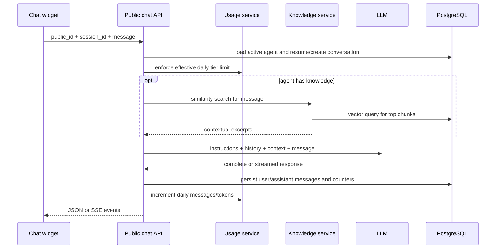

# Chat Champ, conversations, RAG, and usage

**Last verified:** 2026-08-13

## Purpose

Chat Champ reuses Ring Rookie agents as public text-chat agents. A visitor is identified by a client session ID; an agent public ID selects configuration. The backend persists conversations/messages, optionally retrieves agent knowledge, generates a response, streams events when requested, and meters usage.

## Message flow

## Conversation storage

`Conversation` is keyed by UUID and belongs to an agent. `session_id` tracks an anonymous visitor session. Metadata can include user-agent, hashed IP, and referrer. Status supports active/ended/archived; denormalized message/token counts and last-message time support listing and analytics. `Message` rows are ordered by creation time and represent visitor/assistant turns and token metadata.

## Knowledge ingestion

A knowledge base belongs to one agent. Ingestion supports direct text and URLs. The service normalizes text, splits on sentence boundaries, creates overlapping chunks, batches embeddings, and stores one `KnowledgeDocument` row per chunk. Source IDs deduplicate/rebuild a source.

Current constants in `backend/app/services/knowledge_base.py`:

- embedding model: `text-embedding-3-small`;
- chunk size: 1,000 characters;
- chunk overlap: 200 characters;
- maximum query results: 5.

These are implementation values, not token-based limits. Any older statement of “500 tokens with 50 overlap” is stale.

## Retrieval

Search embeds the query and compares it with stored chunk vectors. Agent-level search can span knowledge bases owned by the agent; KB-level search restricts to one knowledge base. Retrieved content is context, not trusted instruction: prompt assembly should clearly delimit it and avoid treating uploaded text as system authority.

## Usage and billing tiers

`UsageRecord` aggregates one row per agent per UTC day: message/conversation counts, prompt/completion/embedding tokens, and knowledge bytes. `AgentBillingConfig` stores one tier/config per agent and optional custom limits. Effective daily limits come from the backend tier map; enterprise can be unlimited. Public chat checks usage before generation and increments it as durable work completes.

## Owner-facing surfaces

Authenticated owners can list/detail conversations, inspect analytics, export records, and request analysis. Usage endpoints return tiers, current status, summaries, daily series, and billing configuration. Knowledge-base endpoints provide create/delete, document management, and search; no dedicated dashboard KB page was found in the current route tree, so this capability may be API-led or incomplete in the UI.

## Privacy and safety

- Visitor metadata should minimize directly identifying data; raw IP addresses should not be persisted when a hash suffices.
- Conversation export/deletion must follow authenticated ownership and compliance settings.
- Public conversation-history access must validate session/conversation association.
- URL ingestion is an SSRF-sensitive boundary and should constrain schemes, redirects, network targets, size, and timeout.
- Uploaded/retrieved content can contain prompt injection; retrieval context must be untrusted.

## Governing paths

- `backend/app/api/chat.py`
- `backend/app/api/conversations.py`
- `backend/app/api/knowledge_base.py`
- `backend/app/api/usage.py`
- `backend/app/api/chat.py` (generation orchestration is currently route-local)
- `backend/app/services/knowledge_base.py`
- `backend/app/models/conversation.py`
- `backend/app/models/knowledge_base.py`
- `backend/app/models/usage.py`
- `frontend/src/app/dashboard/conversations/`
- `frontend/src/lib/api/conversations.ts`
