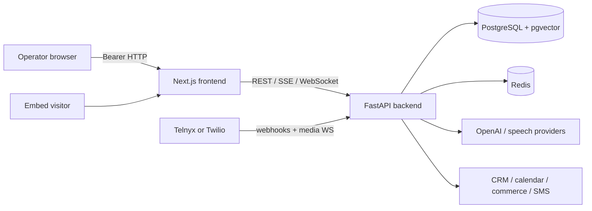
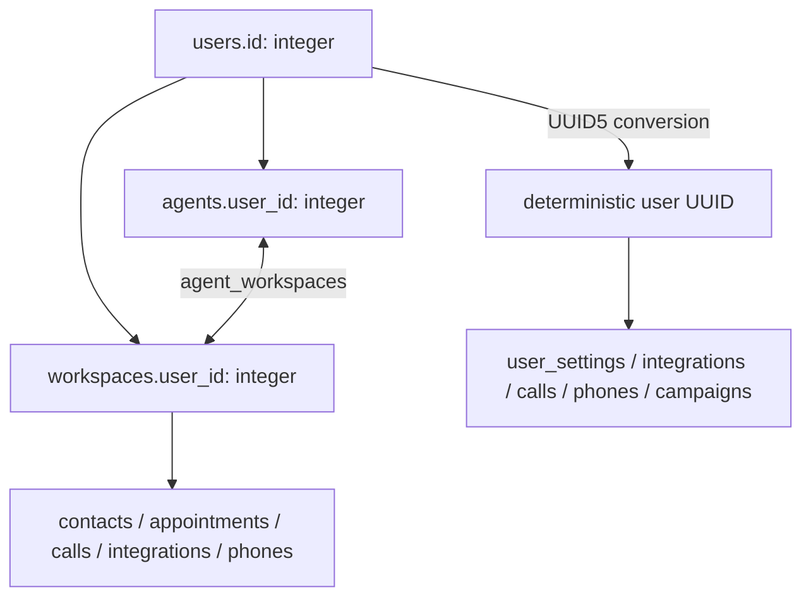

# System architecture

**Status:** descriptive architecture (current implementation)  
**Last verified:** 2026-08-13

## Context

Ring Rookie is a modular monolith with multiple realtime edges. The Next.js application is the operator UI and public embed host. FastAPI is both the authenticated control plane and the transport gateway for HTTP, SSE, and WebSocket traffic. PostgreSQL is the durable system of record; Redis supports readiness, rate limiting, and runtime coordination. External providers supply realtime AI, speech, telephony, messaging, commerce, CRM, and scheduling.

## Runtime boundaries

### Frontend

The App Router defines login/register, an authenticated dashboard shell, and public embed routes. Client-side providers handle auth state, query caching, theme, workspace selection, and responsive navigation. Domain API clients under `frontend/src/lib/api/` translate UI actions into backend calls.

### Backend application

`backend/app/main.py` creates the FastAPI app, installs request-ID and security-header middleware, configures CORS, conditionally enables Sentry/OpenTelemetry, mounts API and WebSocket routers, and coordinates database/Redis lifecycle. Routes depend on async SQLAlchemy sessions and delegate non-trivial behavior into services.

### Persistence

SQLAlchemy models represent users, agents, workspaces, CRM records, calls, campaigns, public conversations, knowledge chunks, usage, integrations, settings, privacy/consent, effect claims, and lessons. Alembic migrations are authoritative for deployed schema. pgvector enables embedding similarity for Chat Champ knowledge retrieval.

### Realtime planes

1. **Browser voice test:** frontend connects to `/ws/realtime/{agent_id}` or obtains a WebRTC session/token through `/api/v1/realtime`.
2. **Public voice embed:** public-ID config/session/token endpoints validate origin, then a public embed WebSocket carries control/audio events.
3. **Telephone voice:** Telnyx/Twilio webhooks establish call state and provider media WebSockets stream audio through the telephony service.
4. **Text chat:** `/api/public/chat/{public_id}/stream` emits server-sent events; a non-streaming message endpoint is also available.

## Identity and tenancy

The mixed integer/UUID identity model is a compatibility constraint, not a generic recommendation. `backend/app/core/auth.py:user_id_to_uuid` is the required bridge. Workspace-aware services should pass `workspace_id` explicitly so credentials and CRM actions are isolated.

## Cross-cutting controls

- JWT bearer authentication protects control-plane routes.
- Public embed and chat use public agent IDs; embed voice additionally enforces configured origin/domain rules.
- Secrets are loaded from environment or encrypted settings/integration records; service logs should never emit decrypted values.
- Security middleware adds standard response headers and request tracing.
- Health endpoints separate liveness, readiness, database, Redis, and CORS diagnostics.
- External service timeout and retry values are centralized in `backend/app/core/config.py`.

## Deployment topology

The checked-in Compose topology runs PostgreSQL/pgvector, Redis, a one-shot migration service, FastAPI, and Next.js. Backend startup depends on successful migration and Redis health; frontend startup depends on backend readiness. PgAdmin and Redis Commander are opt-in tools profiles.

## Architectural constraints and risks

- The application is horizontally scalable only where in-memory runtime state is absent or externally coordinated. See `library/knowledge/private/operations/high-availability.md`.
- Public-ID routes must perform ownership/origin/rate checks at every boundary because they intentionally bypass dashboard auth.
- Route prefixes are historically inconsistent (`/api/v1/*`, `/api/*`, `/crm`, `/campaigns`, `/workspaces`, `/webhooks`, `/ws/*`). API clients must use the actual mounted contract.
- Some product claims and catalog integrations exceed implemented execution paths; documentation must distinguish catalog visibility from runtime support.

## Governing paths

- `backend/app/main.py`
- `backend/app/core/config.py`
- `backend/app/core/auth.py`
- `backend/app/middleware/`
- `frontend/src/app/layout.tsx`
- `frontend/src/app/dashboard/layout.tsx`
- `docker-compose.yml`
