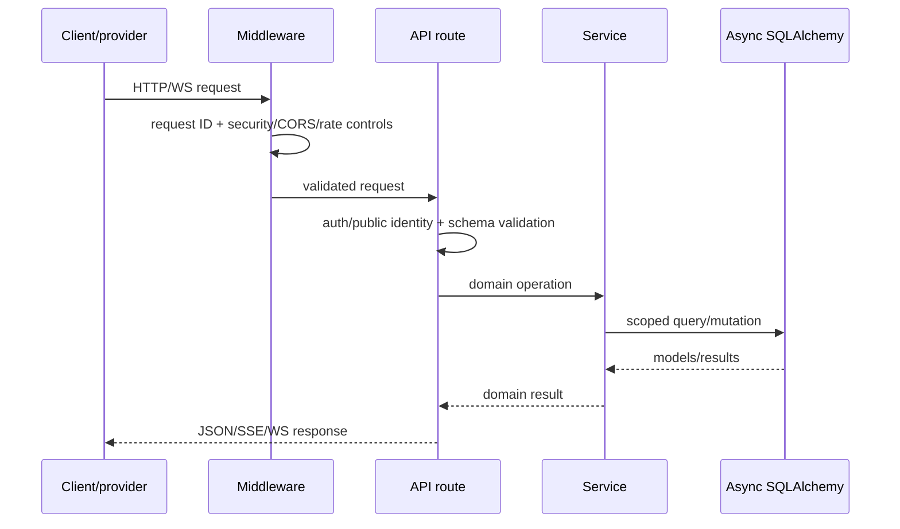

# Backend architecture and module narrative

**Last verified:** 2026-08-13

## Application assembly

`backend/app/main.py` is the composition root. It initializes observability, middleware, CORS, routes, startup resources, and shutdown cleanup. Database access is async SQLAlchemy; Redis is an application dependency but the API can expose dependency-specific health independently.

## API modules

| Module              | Responsibility                                                                |
| ------------------- | ----------------------------------------------------------------------------- |
| `agents.py`         | Agent CRUD plus public embed settings and ID regeneration.                    |
| `auth.py`           | Registration, form-encoded login, current-user identity.                      |
| `calls.py`          | Call history/detail, analytics, agent stats, export, AI analysis.             |
| `campaigns.py`      | Outbound campaign CRUD, contact selection, lifecycle, stats, dispositions.    |
| `chat.py`           | Public Chat Champ config, message generation, SSE streaming, message history. |
| `chatgpt_oauth.py`  | Workspace-scoped ChatGPT OAuth connect/callback/status/refresh/disconnect.    |
| `compliance.py`     | Privacy settings, consent, export, CCPA choices, retention, deletion.         |
| `conversations.py`  | Owner-facing chat history, analytics, export, and analysis.                   |
| `crm.py`            | Contact and appointment CRUD, field requirements, CRM statistics.             |
| `embed.py`          | Public voice-widget config, sessions, WS, tokens, tools, transcript/history.  |
| `health.py`         | Liveness/readiness and DB/Redis/CORS diagnostics.                             |
| `integrations.py`   | Workspace integration credential lifecycle.                                   |
| `knowledge_base.py` | Knowledge bases, text/URL ingestion, listing/deletion, semantic search.       |
| `lessons.py`        | Agent-specific learned lessons and CSV/JSON export.                           |
| `phone_numbers.py`  | Persisted phone-number CRUD.                                                  |
| `realtime.py`       | Authenticated browser voice over WebSocket/WebRTC and transcript save.        |
| `settings.py`       | Workspace-aware provider API-key settings.                                    |
| `telephony.py`      | Provider number operations, outbound calls, voice/status webhooks.            |
| `telephony_ws.py`   | Twilio/Telnyx bidirectional media streams.                                    |
| `tools.py`          | Authenticated direct execution endpoint for registered tools.                 |
| `usage.py`          | Chat tier definitions, daily usage, summaries, billing configuration.         |
| `workspaces.py`     | Workspace CRUD and agent/workspace membership.                                |

## Service layer

- `gpt_realtime.py` manages OpenAI realtime sessions, credential fallback, instructions, tools, audio events, greetings, and transcript accumulation.
- `telephony.py` abstracts Telnyx/Twilio number and call operations; API/webhook modules translate provider events.
- `chat.py` runs public text conversation generation and persistence.
- `knowledge_base.py` chunks text, batches OpenAI embeddings, stores chunks, and searches by similarity.
- `campaign.py` and `campaign_scheduler.py` control campaign state and select runnable contacts.
- `compliance.py` centralizes export, deletion, consent, privacy, and retention behavior.
- `analysis.py` summarizes/analyzes call and chat records.
- `integration_crypto.py` encrypts persisted integration secrets.
- `tools/` owns AI-callable adapters and the registry that filters and dispatches enabled functions.

## Request lifecycle

## Configuration and dependencies

`backend/app/core/config.py` maps environment variables into typed settings. Provider keys, OAuth URLs, database/Redis addresses, CORS, JWT lifetimes, timeouts, retry policy, Sentry, and OpenTelemetry are configured there. Workspace-stored credentials take precedence in relevant voice flows; environment values remain deployment configuration and fallback for selected paths.

## Error and transaction expectations

Routes should convert domain/provider errors to intentional HTTP errors, not leak provider payloads. Mutations generally use request-scoped transactions; multi-step operations should flush when generated IDs are needed and commit only after invariants hold. WebSocket paths must close provider connections and database resources even after client disconnects.

## Tests

Backend tests live under `backend/tests/` and include API, service, model, campaign, compliance, embed, integration, tool, and realtime coverage. They are evidence of intended behavior but do not replace route/service inspection.

## Governing paths

- `backend/app/main.py`
- `backend/app/api/`
- `backend/app/services/`
- `backend/app/core/`
- `backend/app/db/`
- `backend/tests/`
