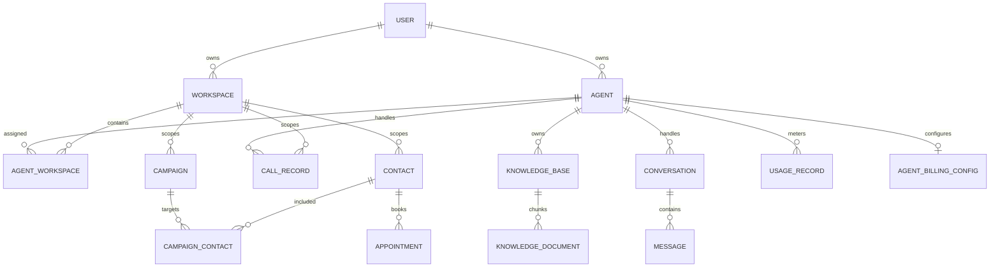

# Data model and persistence

**Last verified:** 2026-08-13

## Persistence stack

Ring Rookie uses async SQLAlchemy 2.0 and Alembic against PostgreSQL 17. Local Compose uses `pgvector/pgvector:0.8.0-pg17`; SQLite variants appear in selected model types to support tests. Redis is not the durable source of product records.

## Domain model

| Aggregate             | Tables/models                                   | Purpose and key relations                                                                                                               |
| --------------------- | ----------------------------------------------- | --------------------------------------------------------------------------------------------------------------------------------------- |
| Identity              | `users`                                         | Integer primary identity; owns agents and workspaces.                                                                                   |
| Agent configuration   | `agents`                                        | UUID agent owned by integer user; stores prompt, provider/voice, tools, telephony, publishing, embed and aggregate call stats.          |
| Tenancy               | `workspaces`, `agent_workspaces`                | Integer-user-owned workspace and many-to-many agent membership with default flags.                                                      |
| CRM                   | `contacts`, `appointments`, `call_interactions` | Contact records, scheduled appointments, and legacy interaction summaries; workspace links remain nullable for migration compatibility. |
| Telephony history     | `call_records`                                  | Durable call/provider/transcript/recording/cost/outcome record associated with agent/workspace/user identity.                           |
| Campaigns             | `campaigns`, `campaign_contacts`                | Outbound campaign rules, denormalized totals, retry/error state, per-contact attempts and disposition.                                  |
| Public chat           | `conversations`, `messages`                     | Visitor session and agent-scoped conversation; ordered messages and denormalized token/message counts.                                  |
| Retrieval             | `knowledge_bases`, `knowledge_documents`        | Agent knowledge configuration and embedded chunks with source identity. A source can produce multiple chunk rows.                       |
| Metering              | `usage_records`, `agent_billing_configs`        | One daily usage record per agent/date and one effective billing-tier configuration per agent.                                           |
| Integrations/settings | `user_integrations`, `user_settings`            | Workspace-aware encrypted credentials/OAuth metadata and provider keys/settings.                                                        |
| Telephony inventory   | `phone_numbers`                                 | Provider number, capabilities, optional workspace, and assigned agent.                                                                  |
| Privacy               | `privacy_settings`, `consent_records`           | User privacy/retention preferences and auditable consent events.                                                                        |
| Learning/evidence     | `lessons_learned`, `effect_claims`              | Agent lessons and tracked effect claims used by analysis/improvement workflows.                                                         |

## Principal relationships

## Identity conversion constraint

`users.id`, `agents.user_id`, and `workspaces.user_id` are integers. Several newer aggregates represent owner identity as UUID. `user_id_to_uuid()` deterministically derives the UUID5 form. Call/settings/integration/campaign/phone code must convert before querying UUID owner columns. Do not cast strings ad hoc or generate random UUIDs.

## Workspace isolation

Workspace scoping is expressed through direct foreign keys, association rows, and workspace-specific credentials. Because legacy contact/appointment/call links can be nullable, service queries must combine owner and workspace filters intentionally. A missing workspace should not silently broaden access in authenticated paths.

## Denormalized counters

Agents, campaigns, conversations, and usage records include counters for fast dashboards and limits. Writers must update counters atomically with the durable event/message/contact transition, or reconcile them. Counters are derived summaries, not substitutes for source rows.

## Knowledge representation

The current service uses `text-embedding-3-small`, character-based sentence-aware chunks (defaults: 1,000 size, 200 overlap), and at most five chunks per query. This differs from older claims of 500-token chunks and IVFFlat-specific behavior. Each `KnowledgeDocument` row represents one chunk; `source_id` groups chunks from one ingested source.

## Migration discipline

`backend/migrations/versions/` contains the full schema history, including merge revisions. Local Compose runs database preparation and `alembic upgrade head` in a dedicated one-shot `migrate` service before API startup. Model changes require a migration; application startup should not replace migration review.

## Governing paths

- `backend/app/models/`
- `backend/migrations/versions/`
- `backend/app/db/base.py`
- `backend/app/db/session.py`
- `backend/app/core/auth.py`
- `backend/app/services/knowledge_base.py`
- `backend/scripts/bootstrap_database.py`
