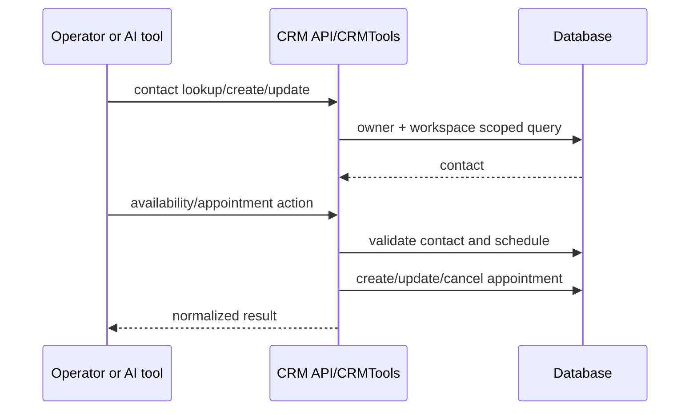
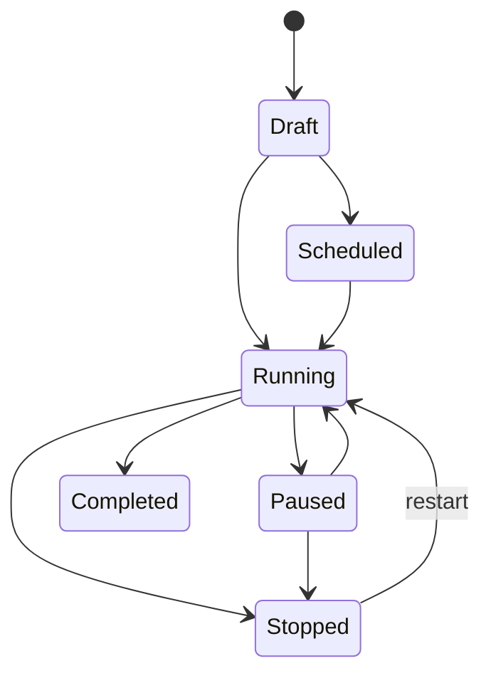

# CRM, appointments, campaigns, and analytics

**Last verified:** 2026-08-13

## CRM ownership model

Contacts belong to an integer user and may belong to a workspace. They store name, phone, optional email/company, status, tags, and notes. Appointments belong to a contact, may belong to a workspace and agent, and store schedule, duration, status, service type, notes, and the creating agent label. `CallInteraction` is a legacy CRM-centric interaction summary; `CallRecord` is the richer telephony record used by current call history and analytics.

The CRM API supports field-requirement discovery, contact CRUD, aggregate statistics, and appointment CRUD. Internal AI tools use the same database through `CRMTools`, with the registry passing owner and workspace context.

## Contact and appointment flow

Contact status values are convention-based (`new`, `contacted`, `qualified`, `converted`, `lost`). Appointment statuses are similarly string-based (`scheduled`, `completed`, `cancelled`, `no_show`). API/service validation must remain aligned because database columns are strings rather than database enums.

## Campaign aggregate

A campaign belongs to a UUID owner identity and one workspace, references an agent, and supplies the outbound from-number. It stores:

- lifecycle status and optional schedule window;
- daily calling hours, days, and timezone;
- calls-per-minute and maximum concurrency;
- per-contact attempt cap and retry delay;
- denormalized contact/call-duration totals;
- last error, error count, and error timestamp;
- started/completed timestamps.

`CampaignContact` joins a CRM contact to a campaign and tracks status, attempt timing, most recent call/result, disposition/notes, callback request, and priority.

## Campaign lifecycle

The API exposes explicit start, pause, stop, and restart commands. Contact population can use explicit IDs or a server-side filter preview/apply flow. Scheduler/service logic must enforce calling windows, attempt limits, retry timing, rate/concurrency controls, and terminal status before initiating provider calls.

## Dispositions and outcomes

Telephony outcome and business disposition are distinct. A provider/call outcome describes what happened technically (answered, no answer, busy, voicemail, failed). A campaign disposition describes the business result (for example qualified, appointment, callback, not interested). The API exposes disposition options, aggregate disposition stats, and per-contact updates.

## Call analytics

Call endpoints support paginated list/detail, aggregate analytics, per-agent stats, export, and analysis. Durable call records can include direction, provider, identifiers, participants, timing/duration, status/outcome, transcript/recording, summary/sentiment/actions, cost, and workspace/agent identity. Analytics should derive from durable records and clearly label any AI-generated fields.

## Conversation analytics

Conversation endpoints parallel the owner-facing call experience: list/detail, analytics, export, and analysis. Conversation counters speed common dashboards, while messages are the authoritative content rows. Usage records are billing/metering aggregates and should not be conflated with conversation analytics.

## Consistency and failure rules

- Contact selection must remain workspace-scoped when adding campaign members.
- A campaign cannot call through an agent or number unavailable to its workspace.
- Scheduler selection and status transition should be atomic enough to prevent duplicate workers claiming one contact.
- Provider call creation may succeed before local persistence completes; correlation and reconciliation are required.
- Retry only eligible failures and respect local time windows/DST.
- Updating denormalized totals must not erase source campaign-contact or call records.
- Export/analysis queries must enforce the same owner/workspace scope as list/detail.

## Governing paths

- `backend/app/api/crm.py`
- `backend/app/api/campaigns.py`
- `backend/app/api/calls.py`
- `backend/app/api/conversations.py`
- `backend/app/services/tools/crm_tools.py`
- `backend/app/services/campaign.py`
- `backend/app/services/campaign_scheduler.py`
- `backend/app/services/analysis.py`
- `backend/app/models/contact.py`
- `backend/app/models/appointment.py`
- `backend/app/models/campaign.py`
- `backend/app/models/call_record.py`
- `frontend/src/app/dashboard/crm/`
- `frontend/src/app/dashboard/appointments/`
- `frontend/src/app/dashboard/campaigns/`
- `frontend/src/app/dashboard/calls/`
