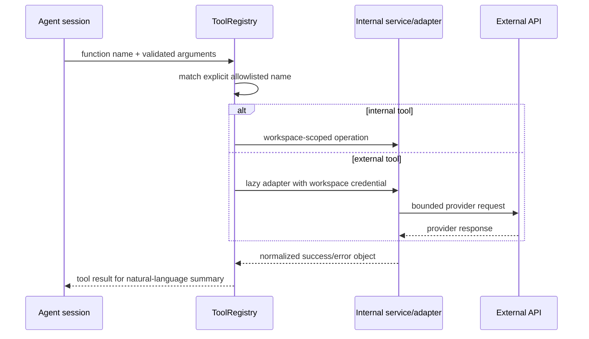

# Integrations and AI tool runtime

**Last verified:** 2026-08-13

## Two related concepts

1. **Integration catalog/credentials:** UI and API records describe connectable products and store workspace-scoped encrypted configuration.
2. **Executable AI tools:** `ToolRegistry` has explicit adapters, schemas, and dispatch branches the model can call.

A catalog entry is not proof of executable runtime support. Current documentation and product claims should make that distinction.

## Implemented registry families

| Family                | Availability condition      | Representative operations                                                     |
| --------------------- | --------------------------- | ----------------------------------------------------------------------------- |
| Call control          | `call_control` enabled      | end call, transfer call, send DTMF.                                           |
| Internal CRM/bookings | `crm` or `bookings` enabled | search/create contact; availability; book/list/cancel/reschedule appointment. |
| GoHighLevel           | token + location            | contacts, tags, calendars/slots, appointments, pipelines/opportunities.       |
| Calendly              | access token                | event types, availability, scheduling links, events, cancellation.            |
| Shopify               | token + shop domain         | customer/order/product/inventory operations defined by adapter.               |
| Twilio SMS            | SID + token + from number   | send SMS through Twilio adapter.                                              |
| Telnyx SMS            | API key + from number       | send SMS through Telnyx adapter.                                              |

`enabled_tools` selects integration families for backward compatibility. `enabled_tool_ids` optionally narrows a family to specific function names. If no granular entry exists for an enabled family, all adapter functions are exposed.

## Credential lifecycle

Authenticated users connect integrations through `/api/v1/integrations`, with workspace context. Secrets are encrypted before persistence by `integration_crypto.py`. Service code obtains decrypted credentials only for the selected workspace and initializes adapters lazily when the required fields exist. OAuth refresh metadata can be stored where applicable.

ChatGPT OAuth is a distinct, first-class route group and credential flow for OpenAI access. It is not dispatched as an AI business tool.

## Execution flow

## Design rules

- Do not dispatch arbitrary function names, modules, or URLs supplied by the model.
- Validate arguments against the advertised tool schema and recheck authorization in the handler.
- Workspace scope is mandatory for tenant data and credential lookup.
- Set provider-specific timeouts and safe retry behavior; do not blindly retry non-idempotent creates.
- Normalize provider errors and redact tokens, headers, customer data, and full response bodies from logs.
- Tool results should be compact and deterministic enough for voice latency constraints.
- Credentials existing does not automatically enable tools; agent selection still governs exposure.

## Catalog drift

The root README advertises “30+ integrations” across many vendors. The explicit runtime registry currently imports seven families (including internal/control families). Additional catalog items may be UI placeholders, credential-only records, or future work. Before claiming end-to-end support, verify a catalog definition, credential schema, adapter, registry definition exposure, dispatch branch, tests, and UI configuration.

## Governing paths

- `backend/app/api/integrations.py`
- `backend/app/api/tools.py`
- `backend/app/services/tools/registry.py`
- `backend/app/services/tools/`
- `backend/app/services/integration_crypto.py`
- `backend/app/models/user_integration.py`
- `frontend/src/app/dashboard/integrations/page.tsx`
- `frontend/src/data/integrations.ts`
