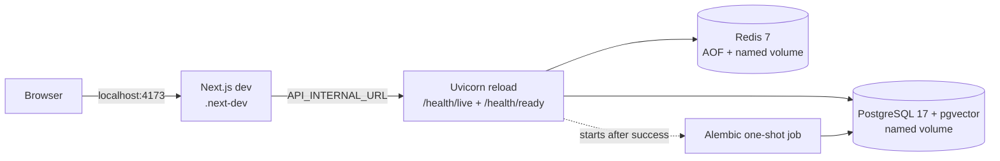
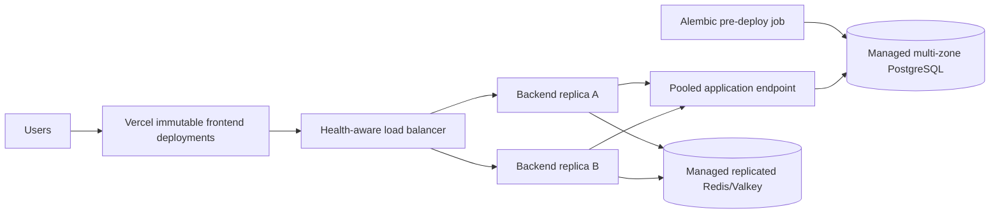

# High availability and hot reload

## Scope

Ring Rookie uses two different availability models:

- **Local development durability:** Docker Compose supervises one frontend, backend, PostgreSQL, and Redis instance. Named volumes preserve data and restart policies recover processes.
- **Production high availability:** redundant instances, health-aware routing, multi-zone managed data services, backups, and controlled rollout. Local Compose does not provide this.

## Local topology

`next build` writes `.next-build`; the live development server writes `.next-dev`. This separation prevents a quality check from deleting manifests that the running server is serving.

Backend liveness at `/health/live` proves that the process can answer HTTP. Readiness at `/health/ready` proves PostgreSQL and Redis respond; failures return HTTP 503 and only `unavailable`, never driver exception or connection-string text.

## Production target

### Backend rollout contract

1. Run Alembic once as a pre-deploy job; replicas never migrate in their entrypoint.
2. Start at least two stateless backend replicas behind a health-aware load balancer.
3. Gate traffic on `/health/ready`; use `/health/live` only to decide whether a process is wedged.
4. During rolling replacement, send SIGTERM, stop new traffic, allow the configured grace period, then terminate.
5. Keep singleton ownership, locks, durable claims, and job state outside one process. Database state remains authoritative.

### PostgreSQL contract

Use managed multi-zone PostgreSQL with automated failover, point-in-time recovery, tested backups, encryption, and a pooled application endpoint. Test restoration separately from backup creation. Application migrations must use expand/backfill/contract sequencing so old and new replicas can overlap.

### Redis/Valkey contract

Use managed replication and automated failover if Redis becomes necessary for correctness. Until then, Redis remains cache/coordination infrastructure and durable business claims remain database-backed. Configure reconnect behavior and bounded timeouts in every replica.

### Frontend contract

Vercel immutable deployments and edge routing provide frontend availability. Never run Next.js development mode or hot reload in production. Health monitoring must exercise a deployed page and its backend route, not only the edge response.

## Failure and recovery expectations

| Failure | Expected behavior | Verification |
|---|---|---|
| Backend process exits locally | Compose restarts it | Kill PID, observe healthy recovery |
| Frontend process exits locally | Compose restarts it | Kill PID, observe `/login` recovery |
| PostgreSQL or Redis restarts locally | Readiness returns 503, then recovers | Restart container; run stack smoke |
| Production backend replica fails | Load balancer removes only that replica | Provider health and rollout test |
| Production database primary fails | Managed service promotes a standby | Provider failover exercise |
| Region is lost | Depends on chosen provider/tier | Document after platform selection |

## Backup and restore

Production requires automated snapshots plus point-in-time recovery. Set retention and recovery objectives from business requirements, alert on backup failures, and run a timed restore exercise at least quarterly. A backup without a verified restore is not a recovery control.

## Blocked production decision

Repository work makes Ring Rookie deployment-ready but does not provision fake infrastructure. A human must select the backend/database platform and budget tier before these values can be committed:

- regions and availability zones;
- backend minimum/maximum replica counts;
- load balancer and rollout configuration;
- PostgreSQL service, size, pooling endpoint, backup retention, RPO, and RTO;
- replicated Redis/Valkey tier, if required;
- observability and paging provider.

**Default recommendation:** managed multi-zone PostgreSQL plus two backend replicas behind a health-aware load balancer. Increase tiers only when measured traffic, recovery objectives, or compliance require it.
