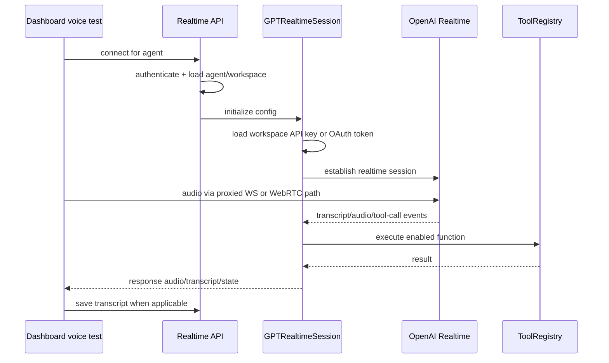
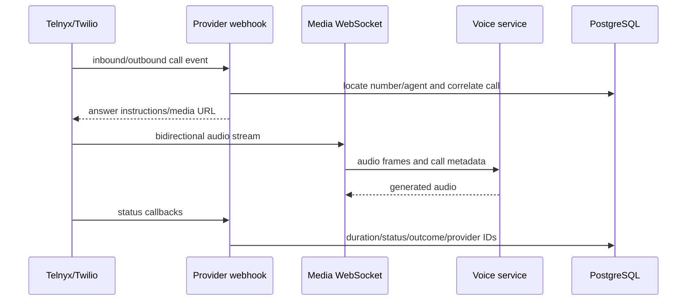

# Voice, realtime, and telephony flows

**Last verified:** 2026-08-13

## Voice configuration

An agent stores tier/provider configuration, system prompt, language, voice, turn-detection mode/threshold/padding/silence, temperature, token cap, greeting, enabled integrations/tools, recording/transcription flags, and publication/embed state. The service augments the user prompt with current workspace timezone, language-only instructions, voice brevity, and booking timestamp rules.

## Browser test flow

The backend supports a WebSocket proxy and WebRTC bootstrap/token routes. Connection cleanup must finalize transcript state and close provider resources on normal end, error, or client disconnect.

## Public voice embed

The embed is addressed by `Agent.public_id`. Config/session/token calls verify the agent is active, published/embed-enabled as required, and the request origin matches `allowed_domains`. The public WebSocket handles voice traffic. Separate tool-call and transcript endpoints support direct-provider/WebRTC flows where tool execution and persistence still need backend authority.

Domain rules:

- Empty domain allowlists are development-permissive and should not be the production default.
- `*.example.com` matches subdomains, not unrelated suffixes.
- Null origins are accepted only under the documented localhost exception.
- Public IDs are locators, not secrets; authorization still comes from endpoint policy.

## Agent phone-number assignment

Existing agents can receive an inbound number from **Agents → Advanced**. The editor lists live Telnyx or Twilio inventory using the first selected workspace's credentials, or account-level credentials when the agent has no selected workspace. Each result is enriched with the current user's assigned agent ID, allowing the selector to label numbers already in use.

Assignment is stored on `Agent.phone_number_id` through `PUT /api/v1/agents/{agent_id}`. The endpoint distinguishes an omitted field from explicit `null`, clears an equivalent leading-plus/no-plus assignment from another agent owned by the same user, and commits the reassignment with the target update. Inbound lookup accepts either optional-plus representation.

The complete contract—including UI states, API bodies, authorization, normalization limits, concurrency caveats, incident diagnostics, and test evidence—is in [Agent phone-number assignment](agent-phone-number-assignment.md).

## Telephone flow

Telnyx is the primary provider and Twilio is optional. The API also exposes authenticated number search/purchase/release and outbound call start/hangup operations. Persisted `PhoneNumber` inventory is related but distinct from live provider operations.

## Tools during voice

`ToolRegistry` receives integer user identity, optional workspace, and decrypted integration configuration. It exposes only enabled definitions, optionally filtered by granular `enabled_tool_ids`. Internal CRM/booking tools are workspace-scoped. External adapters are initialized only when required credential fields exist. Call-control tools handle end, transfer, and DTMF semantics.

## Credential resolution

Realtime OpenAI sessions prefer a workspace API key from settings. If absent, the service attempts a workspace-scoped ChatGPT OAuth access token and raises an actionable configuration error if neither exists. This is separate from deployment-level provider environment variables and should not leak one workspace's credentials into another.

## Transcript and recording lifecycle

Agent flags determine intended transcript/recording behavior. Call records can store transcript, recording references, summaries, timing, cost, and outcomes. Public embed transcript saving converts integer owner identity to the deterministic UUID expected by call records. Compliance settings can impose consent and retention behavior beyond the agent toggle.

## Failure modes

- Provider WebSocket disconnect: finalize partial call safely and avoid duplicate retries.
- Tool timeout/failure: return a natural, bounded error to the model without exposing credentials.
- Invalid workspace credential: fail before provider connection when possible.
- Duplicate webhook: correlate by provider event/call ID and make updates idempotent.
- Missing workspace: do not widen credential or CRM scope silently.
- Recording/transcription disabled: avoid persisting content contrary to configuration/consent.

## Governing paths

- `backend/app/api/realtime.py`
- `backend/app/api/embed.py`
- `backend/app/api/telephony.py`
- `backend/app/api/telephony_ws.py`
- `backend/app/services/gpt_realtime.py`
- `backend/app/services/telephony/`
- `backend/app/services/tools/`
- `backend/app/models/agent.py`
- `backend/app/models/call_record.py`
- `backend/tests/test_api/test_agent_phone_assignment.py`
- `frontend/src/app/dashboard/agents/[id]/page.tsx`
- `frontend/src/app/dashboard/test/page.tsx`
- `frontend/src/lib/realtime-webrtc.ts`
- `frontend/src/app/embed/[publicId]/page.tsx`
